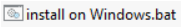
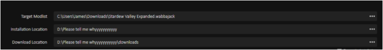

# In the Stardew of the Valley

DISCLAIMER: I AM NOT RESPONSIBLE FOR YOUR PC BLOWING UP

**Please follow the instructions written below in a helpful bullet point format. Believe me, this won’t take you long.**

- First off, install Stardew Valley. Pretty sure any LEGAL version will work, but I’ve only tested the Steam version, so let me know if this isn’t accurate. No, I will not support piracy.
- Once that’s done, you’ll want to manually download [SMAPI from the Nexus](https://www.nexusmods.com/stardewvalley/mods/2400?tab=files). Extract the ZIP folder you’re given into any folder EXCEPT the Stardew Valley installation folder, and run the .bat file inside. This will install SMAPI for you.\
 
- Following this, Go ahead and run Stardew Valley once, just to make sure everything is working fine. I expect exactly 0 issues to appear, but hey, you can never be too careful.
- Then comes the fun part: From the Wabbajack UI (Which you can grab from here: [Wabbajack Tool](https://www.wabbajack.org/#/)), you’ll download “In the Stardew of the Valley”, and set an installation location/download location as usual via the UI. Please remember: Your installation/download location CANNOT be the game folder. Make a new one somewhere else.
-Now, once the installation is finished, so are you. Stardew Valley doesn’t have any files that need moved, so all you need to do is open the Mod Organizer 2 installation that you’ve been given, choose SMAPI from the dropdown in the top right corner (will probably be there by default, but just in case…), and run the game. Ignore the CMD window that comes up, as it’s just a visual log. If you have any issues running the game, let me know, and I’ll help you grab the log so I can see what broke. I promise I won’t blame you….probably.\

- Be sure to check out my “Some mod info” document to see what a few of these mods do, as explained by a very exhausted Patchier in a single sentence (sometimes more)
